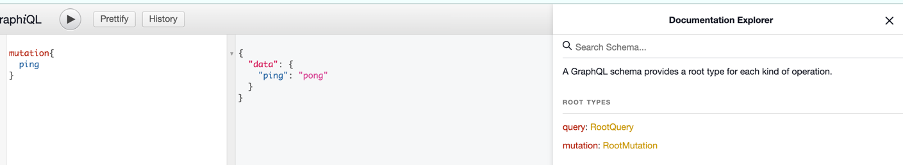

# universal

Basic, universal, everyone's package

---

## 包功能说明

### 1. 链式反应

> 应用场景：解决if地狱问题

* 传统写法

 ```go

func Demo() error {
    err := doSomething1()
    if err != nil {
        return err
    }
    
    err = doSomething2()
    if err != nil {
        return err
    }
    
    err = doSomething3()
    if err != nil {
        return err
    }
    
    return nil
}
```

* 链式反应

```go
package main

import (
	"errors"
	"fmt"
	"github.com/aide-cloud/universal/chain"
)

func Action1() error {
	// do something
	return nil
}

func Action2() error {
	// do something
	return nil
}

func Action3() error {
	// do something
	return nil
}

func CheckName(name string) error {
	if name == "" {
		return errors.New("name is empty")
	}

	if len(name) > 10 {
		return errors.New("name is too long")
	}

	return nil
}

func CheckAge(age int) error {
	if age < 0 {
		return errors.New("age is too small")
	}

	if age > 100 {
		return errors.New("age is too big")
	}

	return nil
}

func main() {
	chainAction := chain.NewChain(
		chain.WithTask(
			Action1,
			Action2,
			Action3,
			func() error {
				return CheckName("aide")
			},
			func() error {
				return CheckAge(20)
			},
		),
	)
	if err := chainAction.Do(); err != nil {
		panic(err)
	}

	fmt.Println("done")
}

```

### 2. 通用日志

> 应用场景：统一日志格式

### 3. 通用错误

> 应用场景：统一错误处理

### 4. 执行器

> 应用场景：多服务程序启动，优雅退出，信号处理，资源释放

* 简单使用 
```go
package main

import (
	"fmt"
	"github.com/aide-cloud/universal/executor"
)

type MyServer struct{}
type ChildServer struct{}

func (m *ChildServer) Start() error {
	// do something
	fmt.Println("ChildServer start")
	return nil
}

func (m *ChildServer) Stop() {
	// do something
	fmt.Println("ChildServer stop")
}

func NewChildServer() *ChildServer {
	return &ChildServer{}
}

func (m *MyServer) Start() error {
	// do something
	fmt.Println("start")
	return nil
}

func (m *MyServer) Stop() {
	// do something
	fmt.Println("stop")
}

func (m *MyServer) ServicesRegistration() []executor.Service {
	return []executor.Service{
		NewChildServer(),
	}
}

func NewMyServer() *MyServer {
	return &MyServer{}
}

func main() {
	executor.ExecMulSerProgram(NewMyServer())
}

```

* 使用LierCmd快速启动

```go
package main

import (
	"fmt"
	"github.com/aide-cloud/universal/executor"
)

type MyServer struct{}
type ChildServer struct{}

func (m *ChildServer) Start() error {
	// do something
	fmt.Println("ChildServer start")
	return nil
}

func (m *ChildServer) Stop() {
	// do something
	fmt.Println("ChildServer stop")
}

func NewChildServer() *ChildServer {
	return &ChildServer{}
}

func (m *MyServer) Start() error {
	// do something
	fmt.Println("my server start")
	return nil
}

func (m *MyServer) Stop() {
	// do something
	fmt.Println("my server stop")
}

func NewMyServer() *MyServer {
	return &MyServer{}
}

func main() {
	executor.ExecMulSerProgram(executor.NewLierCmd(
		executor.WithServiceName("master"),
		executor.WithProperty(map[string]string{
			"version": "1.0.0",
			"name   ": "master",
			"time   ": "2020-12-12 12:12:12",
			"author ": "aide-cloud",
		}),
		executor.WithServices(NewMyServer(), NewChildServer()),
	))
}

``` 

> 运行效果
```bash
master service starting...
┌───────────────────────────────────────────────────────────────────────────────────────┐
│                                      _____  _____   ______                            │
│                               /\    |_   _||  __ \ |  ____|                           │
│                              /  \     | | || |  | || |__                              │
│                             / /\ \    | | || |  | ||  __|                             │
│                            / /__\ \  _| |_|| |__| || |____                            │
│                           /_/    \_\|_____||_____/ |______|                           │                                                       
│                                 good luck and no bug                                  │
└───────────────────────────────────────────────────────────────────────────────────────┘

┌──────────────────────────────────────────────────────────────────────────────────────
├── version: 1.0.0
├── name   : master
├── time   : 2020-12-12 12:12:12
├── author : aide-cloud
└──────────────────────────────────────────────────────────────────────────────────────

ChildServer start
my server start
^Cmy server stop
ChildServer stop
master service stopped!
```


### 5. 加密模块

> 应用场景：详尽的加密算法

  1. AES加密
     * 示例
        ```go
        package main

        import (
            "fmt"
            "github.com/aide-cloud/universal/cipher"
        )
        
        func main() {
            key, iv := "1234567890123456", "1234567890123456"
            aes, err := cipher.NewAes(key, iv)
            if err != nil {
                fmt.Println(err)
                return
            }
        
            // 加密
            encryptStr, err := aes.EncryptAesBase64("123")
            if err != nil {
                fmt.Println(err)
                return
            }
        
            // 解密
            decryptStr, err := aes.DecryptAesBase64(encryptStr)
            if err != nil {
                fmt.Println(err)
                return
            }
        
            fmt.Println("加密前：", "123")
            fmt.Println("加密后：", encryptStr)
            fmt.Println("解密后：", decryptStr)
        }

        ```
  2. MD5加密
     * 示例
        ```go
        package main

        import (
            "fmt"
            "github.com/aide-cloud/universal/cipher"
        )
        
        func show(str string) {
            md5Str := cipher.MD5(str)
            fmt.Println(md5Str)
        }
        
        func main() {
            show("123")
            show("abc")
            show("xxx")
        }
        ```
       
### 6. graphql模块

> 应用场景：graphql服务, 让你的服务更加优雅

* 目录结构
```bash
├── .
├── go.mod
├── go.sum
├── main.go
└── sdl
    └── root.graphql
```

* main.go

```go
package main

import (
	"embed"
	"github.com/aide-cloud/universal/graphql"
	"github.com/gin-gonic/gin"
)

// Content holds all the SDL file content.
//go:embed example/graphql/sdl
var content embed.FS

type Root struct{}

func (r *Root) Ping() string {
	return "pong"
}

// RegisterHttpRouter registers the GraphQL API and GraphiQL IDE.
func RegisterHttpRouter(r *gin.Engine, root any, content embed.FS, dev ...bool) {
	if len(dev) > 0 && dev[0] {
		r.GET(graphql.DefaultViewPath, GinGraphqlView())
	}

	r.POST(graphql.DefaultHandlePath, GinGraphqlHandler(root, content))
}

// GinGraphqlView returns a http.HandlerFunc that can be used to serve the GraphiQL IDE.
func GinGraphqlView() gin.HandlerFunc {
	return gin.WrapF(graphql.View(graphql.Post, graphql.DefaultHandlePath))
}

// GinGraphqlHandler returns a http.Handler that can be used to serve the GraphQL API.
func GinGraphqlHandler(root any, content embed.FS) gin.HandlerFunc {
	return gin.WrapH(graphql.Handler(root, content))
}

func main() {
	r := gin.Default()
	RegisterHttpRouter(r, &Root{}, content, true)
	r.Run()
}
```

* sdl/root.graphql
```graphql
schema {
    query: RootQuery
    mutation: RootMutation
}

type RootQuery {
    ping: String!
}

type RootMutation {
    ping: String!
}
```

* 运行效果
```bash
[GIN-debug] [WARNING] Creating an Engine instance with the Logger and Recovery middleware already attached.

[GIN-debug] [WARNING] Running in "debug" mode. Switch to "release" mode in production.
 - using env:   export GIN_MODE=release
 - using code:  gin.SetMode(gin.ReleaseMode)

[GIN-debug] GET    /view                     --> github.com/gin-gonic/gin.WrapF.func1 (3 handlers)
[GIN-debug] POST   /graphql                  --> github.com/gin-gonic/gin.WrapH.func1 (3 handlers)
[GIN-debug] [WARNING] You trusted all proxies, this is NOT safe. We recommend you to set a value.
Please check https://pkg.go.dev/github.com/gin-gonic/gin#readme-don-t-trust-all-proxies for details.
[GIN-debug] Environment variable PORT is undefined. Using port :8080 by default
[GIN-debug] Listening and serving HTTP on :8080
[GIN] 2023/02/22 - 17:08:29 | 200 |     177.084µs |             ::1 | GET      "/view"
[GIN] 2023/02/22 - 17:08:29 | 200 |      3.5715ms |             ::1 | POST     "/graphql"
[GIN] 2023/02/22 - 17:08:29 | 404 |         792ns |             ::1 | GET      "/favicon.ico"
[GIN] 2023/02/22 - 17:08:37 | 200 |     120.125µs |             ::1 | POST     "/graphql"
[GIN] 2023/02/22 - 17:08:44 | 200 |       88.75µs |             ::1 | POST     "/graphql"
```

* 运行截图

